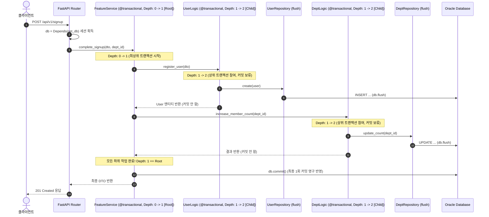
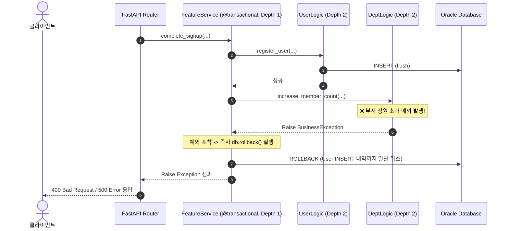

# Transaction 전이 및 트랜잭션 경계 관리

FastAPI 및 SQLAlchemy 기반 아키텍처에서 비즈니스 로직의 원자성(ACID)을 보장하기 위한 **트랜잭션 전이(Transaction Propagation)와 트랜잭션 경계(Transaction Boundary) 관리 원칙**, 그리고 다중 도메인 연계를 위한 `@transactional` 데코레이터의 동작 방식을 정리한 문서입니다.

---

## 1. 문제 배경: Repository에서 `commit()`을 호출하면 안 되는 이유

초기 구현에서 흔히 발생하는 실수는 **Repository의 각 메서드 내부에서 직접 `self.db.commit()`을 호출하는 것**입니다.

```python
# ❌ 안티 패턴: Repository에서 직접 commit()
class UserRepository:
    def create_user(self, user: User) -> User:
        self.db.add(user)
        self.db.commit()  # ❌ 즉시 DB에 영구 반영됨!
        return user
```

### 왜 치명적인 문제가 발생하는가?

1. **트랜잭션 롤백 불가 (원자성 파괴)**:
   - 예를 들어 "회원가입(`create_user`)" 성공 직후 "부서 배정 또는 포인트 지급"에서 에러가 발생하더라도, 이미 회원 데이터는 DB에 영구 저장(`commit`)되어 버려 롤백할 수 없습니다.
2. **트랜잭션 경계 분실**:
   - 트랜잭션의 시작과 끝은 개별 SQL 쿼리 단위가 아니라 **"하나의 비즈니스 유스케이스 단위"**여야 합니다.

---

## 2. 해결 원칙: 계층별 책임 분리 (Separation of Concerns)

Spring의 `@Transactional`이나 엔터프라이즈 아키텍처 표준과 동일하게 **트랜잭션 주도권을 Service/Logic 계층으로 격상**시킵니다.

```
[Service / Logic Layer]   👉 트랜잭션 경계 시작 (@transactional)
       ↓
[Repository Layer]        👉 쿼리 생성 및 전송 (flush() 만 수행, commit 금지)
       ↓
[Service / Logic Layer]   👉 성공 시 일괄 commit() / 예외 시 일괄 rollback()
```

| 계층                    | 사용 메서드           | 역할과 책임                                                                          |
| :---------------------- | :-------------------- | :----------------------------------------------------------------------------------- |
| **Repository Layer**    | **`self.db.flush()`** | 쿼리를 DB 버퍼에 밀어 넣어 ID(UUID)와 시스템 컬럼을 확정짓되, **최종 커밋은 보류**함 |
| **Service/Logic Layer** | **`@transactional`**  | 비즈니스 로직 전체를 감싸서 **성공 시 `commit()`, 예외 발생 시 `rollback()` 총괄**   |

---

## 3. 다중 도메인 트랜잭션 전이 (Transaction Propagation)

향후 **Feature Layer**에서는 단일 도메인뿐만 아니라 **2개 이상의 도메인 로직을 하나의 비즈니스 작업으로 묶어서 실행**하는 경우가 많습니다.  
_(예: `User` 등록 + `Department` 인원수 증가 + `Welcome Coupon` 발급)_

### 1) 조기 커밋(Early Commit) 문제와 해결책

- **문제점**: 상위 `SignupService`에도 `@transactional`이 붙어 있고, 하위 `UserLogic`에도 `@transactional`이 붙어 있다면, 하위 `UserLogic`이 끝나는 순간 먼저 `commit()`을 해버려 이후 단계에서 에러가 발생했을 때 롤백이 불가능해집니다.
- **해결책 (`Propagation.REQUIRED` 원리)**:
  1. **"이미 진행 중인 상위 트랜잭션이 있다면 하위 트랜잭션은 커밋을 보류하고 상위 트랜잭션에 참여한다."**
  2. **"오직 가장 바깥쪽(최상위 Root) 트랜잭션만 모든 작업이 성공했을 때 1회 최종 `commit()`을 실행한다."**
  3. **"중간 어디서든 예외가 발생하면 즉시 전체 작업을 일괄 `rollback()`한다."**

### 2) Caller - Callee 간 트랜잭션 유지 메커니즘

Caller(상위 호출자)에 이미 트랜잭션이 존재할 때 Callee(하위 피호출자)가 이를 그대로 승계받아 유지하는 세부 동작 원리입니다.

```
[Caller (Feature)] depth=0 ──> is_root = True  ──> 트랜잭션 시작 (depth: 0 -> 1)
     │
     └──> [Callee (Domain)] depth=1 ──> is_root = False ──> 상위 트랜잭션 참여 (depth: 1 -> 2)
               │
               └──> [Callee 정상 종료] is_root 가 False 이므로 commit() 생략 (보류)
     │
[Caller 최종 종료] is_root 가 True 이므로 비로소 최종 db.commit() 1회 실행!
```

- **트랜잭션 참여 및 조기 커밋 방지 (Participation & Deferred Commit)**:
  - Caller에 이미 활성화된 트랜잭션이 있으면(`depth > 0`), Callee의 `@transactional`은 `is_root_transaction = False`로 판별됩니다.
  - 따라서 Callee 로직이 끝나더라도 **절대 DB 커밋을 실행하지 않고 Caller의 트랜잭션에 상태를 그대로 유지(보류)**합니다.
- **최종 커밋 책임자 (Root Commit Responsibility)**:
  - 오직 트랜잭션을 최초로 개시한 **가장 바깥쪽 Caller(`is_root_transaction == True`)만이 모든 하위 작업이 정상 완료되었을 때 최종 1회 `db.commit()`을 수행**합니다.
- **원자적 롤백 (Atomic Rollback)**:
  - Callee 내부에서 예외가 발생하거나, Callee가 정상 종료된 후 Caller의 후속 작업에서 예외가 발생하더라도 즉시 `db.rollback()`이 실행되어 **Callee가 수행했던 DB 작업까지 일괄 취소**됩니다.

---

## 4. `@transactional` 데코레이터 구현 상세

[app/config/transaction.py](file:///d:/project-workspace/fast-api-feature-oriented-structure-eaxmple/app/config/transaction.py)는 **`ContextVar`**를 사용하여 비동기/멀티스레드 동시 요청(Concurrent Request) 간 간섭 없이 안전하게 트랜잭션 중첩 깊이(Depth)를 추적합니다.

```python
# app/config/transaction.py
from contextvars import ContextVar
from functools import wraps
from sqlalchemy.orm import Session

# 요청별 독립적인 트랜잭션 중첩 깊이 추적 (Thread-safe & Async-safe)
_transaction_depth: ContextVar[int] = ContextVar("transaction_depth", default=0)

def transactional(func):
    @wraps(func)
    def wrapper(*args, **kwargs):
        db = _extract_session(args, kwargs)

        if db is not None:
            depth = _transaction_depth.get()
            is_root_transaction = (depth == 0) # 👈 최상위 트랜잭션 여부 판별
            _transaction_depth.set(depth + 1)

            try:
                result = func(*args, **kwargs)
                # 오직 최상위 트랜잭션 성공 시에만 최종 1회 커밋!
                if is_root_transaction:
                    db.commit()
                return result
            except Exception:
                # 하위/상위 어디서든 에러 발생 시 전체 일괄 롤백
                db.rollback()
                raise
            finally:
                _transaction_depth.set(_transaction_depth.get() - 1)
```

### 세션 자동 탐색 우선순위 (`_extract_session`)

데코레이터는 다양한 계층의 메서드 시그니처를 유연하게 지원하기 위해 다음 순서로 `Session`을 자동 탐색합니다:

1. 키워드 인자 `kwargs["db"]`
2. 인스턴스 메서드의 `self`에서 `db` 탐색
3. `self.repo`, `self.dept_repository` 같은 Repository 속성의 `db` 탐색
4. `self.user_logic`, `self.dept_logic` 같은 Feature 내부 Domain Logic을 따라 재귀 탐색
5. 위치 인자 목록 `args` 중 `Session` 인스턴스

탐색 과정에서는 이미 방문한 객체를 기록해 순환 참조를 방지합니다. 따라서 Feature가 직접 `db`를 보유하지 않고 Domain Logic만 보유하는 현재 구조에서도 Domain Repository의 동일한 session을 찾아 상위 transaction에 사용할 수 있습니다.

### 현재 프로젝트의 transaction 적용 범위

현재 구현에서 데이터 변경을 수행하는 모든 Feature/Domain Logic 메서드는 `@transactional` 경계 안에서 실행됩니다.

| 계층               | 적용 메서드                                                                                     | 역할                                               |
| :----------------- | :---------------------------------------------------------------------------------------------- | :------------------------------------------------- |
| `UserLogic`        | `register_user`, `modify_user`, `remove_user`                                                   | 사용자 생성/수정/삭제                              |
| `DeptLogic`        | `register_dept`, `modify_dept`, `remove_dept`                                                   | 부서 생성/수정/삭제                                |
| `SignupFlow`       | `signup`                                                                                        | 부서 확인과 사용자 등록을 하나의 유스케이스로 묶음 |
| `OrganizationFlow` | `register_dept`, `register_depts`, `modify_dept`, `modify_depts`, `remove_dept`, `remove_depts` | 부서 변경 유스케이스와 일괄 작업의 최상위 경계     |

조회 전용 메서드에는 `@transactional`을 붙이지 않습니다. Repository는 `flush()`까지만 수행하고, 실제 `commit()`/`rollback()`은 위 Logic/Flow 경계에서 담당합니다.

---

## 5. End-to-End 전체 호출 흐름 및 전이 시나리오

Feature Layer에서 2개 이상의 도메인 로직을 조율할 때의 실제 처리 흐름입니다.

### 1) 정상 흐름 (Commit 성공)



### 2) 예외 발생 흐름 (Rollback 실패 처리)



---

## 6. 실제 코드 예시: Router 및 Feature Service 구현

### 현재 프로젝트의 의존성 조립 방식

현재 프로젝트는 Router가 직접 `Session`을 받아 Feature를 생성하는 방식 대신, FastAPI의 Dependency Injection을 사용합니다.

```text
Router
    -> get_signup_flow() / get_organization_flow()
        -> get_user_logic(), get_dept_logic()
            -> get_db()에서 받은 동일 요청 Session
```

같은 요청 안에서 `get_db`가 반환한 Session이 User/Dept Repository에 전달되고, Feature의 `@transactional`은 내부 Logic/Repository를 재귀 탐색해 그 Session을 사용합니다. 이후 Domain Logic의 `@transactional`은 `ContextVar`의 depth만 증가시키며 최종 commit은 Feature에서 한 번만 수행합니다.

### 1) Router 계층 (`features/users/user_routes.py`)

```python
from fastapi import APIRouter, Depends, status
from sqlalchemy.orm import Session
from app.config.database import get_db
from features.users.user_service import UserSignupFeatureService
from domain.user.user_dto import UserCreate, UserResponse

router = APIRouter(prefix="/users", tags=["Users Feature"])

@router.post("", response_model=UserResponse, status_code=status.HTTP_201_CREATED)
def signup_user(
    dto: UserCreate,
    dept_id: str,
    db: Session = Depends(get_db)  # 👈 단일 세션 생성
):
    # 단일 세션을 주입받아 Feature Service 인스턴스화
    service = UserSignupFeatureService(db)
    new_user = service.complete_signup(dto, dept_id)
    return UserResponse.model_validate(new_user)
```

### 2) Feature Service 계층 (`features/users/user_service.py`)

```python
from sqlalchemy.orm import Session
from app.config.transaction import transactional
from domain.user.user_logic import UserLogic
from domain.user.user_repository import UserRepository
from domain.dept.dept_logic import DeptLogic
from domain.dept.dept_repository import DeptRepository
from domain.user.user_dto import UserCreate

class UserSignupFeatureService:
    def __init__(self, db: Session):
        self.db = db
        # 🌟 동일한 db 세션을 두 도메인 로직에 그대로 주입하여 동일 트랜잭션 공유!
        self.user_logic = UserLogic(UserRepository(db))
        self.dept_logic = DeptLogic(DeptRepository(db))

    @transactional  # 👈 최상위 트랜잭션 경계 (Root)
    def complete_signup(self, dto: UserCreate, dept_id: str):
        # 1. User 도메인 실행 (Depth 2: 상위 트랜잭션 참여 -> 커밋 보류)
        created_user = self.user_logic.register_user(dto)

        # 2. Dept 도메인 실행 (Depth 2: 상위 트랜잭션 참여 -> 커밋 보류)
        self.dept_logic.increase_member_count(dept_id)

        # 3. 모든 도메인 로직 성공 시 최상위 데코레이터에서 최종 1회 db.commit()
        return created_user
```

---

## 7. 다중 도메인 트랜잭션 설계 시 주의사항 (Best Practices)

1. **외부 API 호출은 트랜잭션 외부에서 수행**:
   - 카카오 알림톡, 결제 승인, 메일 발송 등 외부 HTTP 호출은 DB 트랜잭션 내부(`@transactional`)에 두지 않아야 합니다.
   - 이유: DB 커넥션을 오래 점유하여 커넥션 풀 고갈을 초래하며, 외부 API 성공 후 DB 커밋 실패 시 외부 요청을 되돌리기 어렵기 때문입니다.
   - **권장 패턴**: DB 커밋 성공 후(트랜잭션 종료 후)에 외부 API를 호출하거나 이벤트를 발행(Event Outbox 패턴)합니다.
2. **동일 세션 객체 전파 필수**:
   - 여러 도메인을 묶을 때는 반드시 `Depends(get_db)`에서 발급된 동일한 `Session` 인스턴스가 각 도메인의 Repository로 전달되어야 합니다. 서로 다른 세션을 사용하면 트랜잭션 전이가 작동하지 않고 별도의 트랜잭션으로 분리됩니다.
3. **읽기 전용 쿼리와 `@transactional`**:
   - 단순 조회(`SELECT`)의 경우 `@transactional`을 붙이지 않거나, 붙이더라도 CUD 변경 작업이 없으므로 `flush()` 없이 즉시 결과를 반환합니다.

---

## 8. 실무 핵심 요약

1. **단일 세션 주입이 핵심**:
   - Feature 계층에서 여러 도메인을 엮을 때, **FastAPI `Depends(get_db)`로 생성된 동일한 `db: Session` 인스턴스를 모든 도메인에 주입**합니다.
2. **Repository는 `flush()`만 수행**:
   - Repository에서는 절대 `commit()`하지 않고 `flush()`만 호출하여 쿼리를 DB 버퍼에 임시 전송합니다.
3. **`ContextVar` 기반 안전한 중첩 제어**:
   - 동시 요청 환경에서도 스레드/태스크 간 간섭 없이 **최상위 트랜잭션만 `commit()`을 실행**하고, 어느 단계에서든 예외 발생 시 **전체 작업이 일괄 `rollback()`**됩니다.

---

## 9. 이번 transaction 보완 내용과 검증 결과

### 보완한 코드

- `DeptLogic.register_dept`, `modify_dept`, `remove_dept`에 `@transactional` 추가
- `OrganizationFlow`의 단건/일괄 등록, 수정, 삭제 메서드에 `@transactional` 추가
- `app/config/transaction.py`의 `_extract_session()`을 Feature → Domain Logic → Repository 경로까지 재귀 탐색하도록 보완
- Domain Logic과 Feature가 같은 Session을 사용할 때 Root만 commit하고 하위 호출은 commit을 보류하도록 유지

### 추가한 테스트

- `tests/test_transaction_boundaries.py`
  - 변경 메서드의 `@transactional` 적용 여부 검증
  - Domain Logic과 Feature에서 동일 Session을 탐색하는지 검증
- 기존 단위/API 회귀 테스트와 함께 전체 테스트 실행

현재 검증 결과:

```text
17 passed, 1 warning
```

경고는 Starlette 내부의 `anyio` deprecation warning이며, transaction 변경으로 발생한 실패는 아닙니다.
